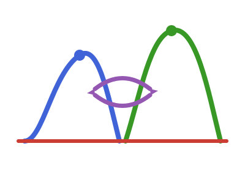

# ReparameterisedDistributions.jl 

<!-- badges:start -->
| **Documentation** | **Build Status** | **Code Quality** | **License & DOI** | **Downloads** |
|:-----------------:|:----------------:|:----------------:|:-----------------:|:-------------:|
| [](https://reparameteriseddistributions.epiaware.org/stable/) [](https://reparameteriseddistributions.epiaware.org/dev/) | [](https://github.com/EpiAware/ReparameterisedDistributions.jl/actions/workflows/test.yaml) [](https://codecov.io/gh/EpiAware/ReparameterisedDistributions.jl) [](https://github.com/EpiAware/ReparameterisedDistributions.jl/actions/workflows/ad.yaml) | [](https://github.com/SciML/SciMLStyle) [](https://github.com/JuliaTesting/Aqua.jl) [](https://github.com/aviatesk/JET.jl) | [](https://opensource.org/licenses/MIT) | [](https://juliapkgstats.com/pkg/ReparameterisedDistributions) [](https://juliapkgstats.com/pkg/ReparameterisedDistributions) |

| ForwardDiff | ReverseDiff (tape) | Enzyme forward | Enzyme reverse | Mooncake reverse | Mooncake forward |
|:---:|:---:|:---:|:---:|:---:|:---:|
| [](https://app.codecov.io/gh/EpiAware/ReparameterisedDistributions.jl?flags%5B0%5D=ad-forwarddiff) | [](https://app.codecov.io/gh/EpiAware/ReparameterisedDistributions.jl?flags%5B0%5D=ad-reversediff) | [](https://app.codecov.io/gh/EpiAware/ReparameterisedDistributions.jl?flags%5B0%5D=ad-enzyme-forward) | [](https://app.codecov.io/gh/EpiAware/ReparameterisedDistributions.jl?flags%5B0%5D=ad-enzyme-reverse) | [](https://app.codecov.io/gh/EpiAware/ReparameterisedDistributions.jl?flags%5B0%5D=ad-mooncake-reverse) | [](https://app.codecov.io/gh/EpiAware/ReparameterisedDistributions.jl?flags%5B0%5D=ad-mooncake-forward) |
<!-- badges:end -->

*Parameter-convention switches for Distributions.jl.*

## Why ReparameterisedDistributions?

Distributions.jl parameterises each family by its native parameters: a `Gamma`
by shape and scale, a `LogNormal` by the mean and standard deviation of its
logarithm. Modellers rarely reason in those coordinates. A delay distribution is
elicited as a mean and a standard deviation, and a prior belongs on the mean,
not on a shape parameter that only implies one.

A prior on a moment cannot be expressed through a native leaf, because
independent priors on shape and scale do not compose into a prior on the mean.
This package wraps a distribution so that its moments *are* its parameters: the
wrapper reports the moments as the estimable parameters, converts to the native
distribution internally through an exact closed form, and stays differentiable
so the moments can be sampled directly.

## Getting started

For the full walkthrough — every supported parameterisation, how to register
a new one, and the AD backends it is checked against — see the
[Getting started documentation](https://reparameteriseddistributions.epiaware.org/dev/getting-started/).

The package is not yet registered. Install it from the repository:

```julia
using Pkg
Pkg.add(url = "https://github.com/EpiAware/ReparameterisedDistributions.jl")
```

`reparameterise` returns a distribution whose parameters *are* the moments:

```julia
using ReparameterisedDistributions, Distributions

d = reparameterise(LogNormal; mean = 8.0, sd = 2.0)

params(d)      # (8.0, 2.0) — the moments, not the native (mu, sigma)
mean(d)        # 8.0
std(d)         # 2.0
logpdf(d, 7.5)
```

It is an ordinary `Distribution`, so it evaluates and samples exactly as the
native one does, and it goes on the right of a `~`. Because the moments are the
parameters, a model puts its priors on them and the sampler moves in moment
coordinates:

```julia
using Turing

@model function delays(x)
    m ~ LogNormal(2.0, 0.5)
    s ~ truncated(Normal(2.0, 1.0); lower = 0.1)
    for i in eachindex(x)
        x[i] ~ reparameterise(LogNormal; mean = m, sd = s, check_args = false)
    end
end
```

The chain comes back in `m` and `s` — a mean and a standard deviation — rather
than in native parameters that only imply them. The conversion is exact algebra,
so it is differentiable and the gradient with respect to the moments is exact.
The package is tested against ForwardDiff, ReverseDiff, Enzyme (forward and
reverse) and Mooncake (forward and reverse).

## Supported parameterisations

| Family | Parameters | Conversion |
|---|---|---|
| `LogNormal` | `mean`, `sd` | the moments of the distribution, not of its logarithm |
| `LogNormal` | `mean`, `var` | as above, given the variance |
| `Gamma` | `mean`, `sd` | `scale = var / mean`, `shape = mean² / var` |
| `Gamma` | `mean`, `var` | as above, given the variance |
| `Gamma` | `mean`, `shape` | `scale = mean / shape`; the shape is native |
| `NegativeBinomial` | `mean`, `overdispersion` | `var = mean + overdispersion · mean²` |

The `NegativeBinomial` parameterisation is the one epidemiology reaches for: the
overdispersion is the excess variance relative to a Poisson, so it tends to the
Poisson limit as it goes to zero. The wrapper stays **discrete** — its value
support is taken from the family it wraps.

Adding a family is one `_to_native` method (the closed form) and one
`_check_moments` method (the guard), so a downstream package can register its
own.

## Where to learn more

- [Getting started](https://reparameteriseddistributions.epiaware.org/dev/getting-started/),
  for the full walkthrough.
- [Documentation](https://reparameteriseddistributions.epiaware.org/dev/)
- [EpiAware](https://github.com/EpiAware), the wider ecosystem this package
  belongs to.

<!-- standard-sections:start -->
<!-- MANAGED by EpiAwarePackageTools.scaffold — do not edit between the
     markers. These standard sections are re-rendered on every scaffold_update;
     edit the package-owned sections outside them, or CITATION.cff. -->

## Contributing

We welcome contributions and new contributors! Please open an issue or pull request on [GitHub](https://github.com/EpiAware/ReparameterisedDistributions.jl). This package follows [ColPrac](https://github.com/SciML/ColPrac) and the [SciML style](https://github.com/SciML/SciMLStyle).

## How to cite

If you use ReparameterisedDistributions in your work, please cite it. Citation metadata lives in [`CITATION.cff`](https://github.com/EpiAware/ReparameterisedDistributions.jl/blob/main/CITATION.cff), which GitHub renders as a "Cite this repository" button on the repository page.

## Code of conduct

Please note that the ReparameterisedDistributions project is released with a [Contributor Code of Conduct](https://github.com/EpiAware/.github/blob/main/CODE_OF_CONDUCT.md). By contributing, you agree to abide by its terms.
<!-- standard-sections:end -->
