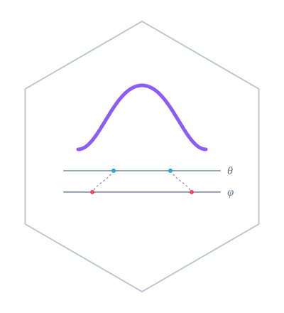

# ReparameterisedDistributions.jl 

<!-- badges:start -->
| **Documentation** | **Build Status** | **Code Quality** | **License & DOI** | **Downloads** |
|:-----------------:|:----------------:|:----------------:|:-----------------:|:-------------:|
| [](https://reparameteriseddistributions.epiaware.org/stable/) [](https://reparameteriseddistributions.epiaware.org/dev/) | [](https://github.com/EpiAware/ReparameterisedDistributions.jl/actions/workflows/test.yaml) [](https://codecov.io/gh/EpiAware/ReparameterisedDistributions.jl) [](https://github.com/EpiAware/ReparameterisedDistributions.jl/actions/workflows/ad.yaml) | [](https://github.com/SciML/SciMLStyle) [](https://github.com/JuliaTesting/Aqua.jl) [](https://github.com/aviatesk/JET.jl) | [](https://opensource.org/licenses/MIT) | [](https://juliapkgstats.com/pkg/ReparameterisedDistributions) [](https://juliapkgstats.com/pkg/ReparameterisedDistributions) |

| ForwardDiff | ReverseDiff (tape) | Enzyme forward | Enzyme reverse | Mooncake reverse | Mooncake forward |
|:---:|:---:|:---:|:---:|:---:|:---:|
| [](https://app.codecov.io/gh/EpiAware/ReparameterisedDistributions.jl?flags%5B0%5D=ad-forwarddiff) | [](https://app.codecov.io/gh/EpiAware/ReparameterisedDistributions.jl?flags%5B0%5D=ad-reversediff) | [](https://app.codecov.io/gh/EpiAware/ReparameterisedDistributions.jl?flags%5B0%5D=ad-enzyme-forward) | [](https://app.codecov.io/gh/EpiAware/ReparameterisedDistributions.jl?flags%5B0%5D=ad-enzyme-reverse) | [](https://app.codecov.io/gh/EpiAware/ReparameterisedDistributions.jl?flags%5B0%5D=ad-mooncake-reverse) | [](https://app.codecov.io/gh/EpiAware/ReparameterisedDistributions.jl?flags%5B0%5D=ad-mooncake-forward) |
<!-- badges:end -->

*Parameter-convention switches for Distributions.jl.*

## Why ReparameterisedDistributions?

- A delay is elicited as a mean and a standard deviation, but Distributions.jl
  names each family by its native parameters, so the coordinates a modeller
  reasons in are not the ones they have to supply.
- Independent priors on shape and scale do not compose into a prior on the
  mean, so a prior on a moment cannot be expressed through a native leaf at
  all.
- `reparameterise` makes the moments a distribution's parameters, so a prior
  lands on the mean rather than on a shape parameter that merely implies one.
- Conversion to the native distribution runs through an exact closed form and
  stays differentiable, so the moments can be sampled directly inside a model.

## Getting started

See the
[Getting started documentation](https://reparameteriseddistributions.epiaware.org/dev/getting-started/)
for every supported parameterisation, how to register a new one, and the AD
backends this package is checked against.

The package is not yet registered.
Install it from the repository:

```jl
using Pkg
Pkg.add(url = "https://github.com/EpiAware/ReparameterisedDistributions.jl")
```

`reparameterise` returns a distribution whose parameters *are* the moments, so
a prior goes on the mean rather than on a shape that only implies one.

```julia
using ReparameterisedDistributions, Distributions, Turing, Random

Random.seed!(1)

truth = reparameterise(Gamma; mean = 8.0, sd = 3.0)
y = rand(truth, 200)

@model function delay(y)
    delay_mean ~ truncated(Normal(8.0, 4.0); lower = 0.0)
    delay_sd ~ truncated(Normal(3.0, 2.0); lower = 0.0)
    y .~ reparameterise(Gamma; mean = delay_mean, sd = delay_sd,
        check_args = false)
end

chain = sample(delay(y), NUTS(), 500; progress = false)
```

The chain comes back in a mean and a standard deviation, the coordinates the
delay was elicited in, rather than in native parameters that only imply them.

```julia
using CairoMakie, AlgebraOfGraphics, DataFramesMeta

CairoMakie.activate!(type = "png", px_per_unit = 2)

draws = DataFrame(
    value = vcat(vec(chain[:delay_mean]), vec(chain[:delay_sd])),
    moment = vcat(fill("mean", length(chain[:delay_mean])),
        fill("sd", length(chain[:delay_sd])))
)
actual = DataFrame(moment = ["mean", "sd"], value = [8.0, 3.0])

draw(
    data(draws) * mapping(:value, layout = :moment) *
    AlgebraOfGraphics.density() * visual(Lines, linewidth = 2) +
    data(actual) * mapping(:value, layout = :moment) *
    visual(VLines, color = :black, linestyle = :dash);
    facet = (; linkxaxes = :none)
)
```

The conversion is exact algebra, so it is differentiable and the gradient with
respect to the moments is exact.
The package is tested against ForwardDiff, ReverseDiff, Enzyme and Mooncake, in
both forward and reverse mode.

## Related packages

- [ComposedDistributions.jl](https://composeddistributions.epiaware.org/dev/)
  builds delay distributions by composing leaves; a reparameterised leaf
  carries its moments as its parameters, so a prior sits on a component's mean
  rather than on a native shape.
- [ConvolvedDistributions.jl](https://convolveddistributions.epiaware.org/dev/),
  [ModifiedDistributions.jl](https://modifieddistributions.epiaware.org/dev/)
  and
  [CensoredDistributions.jl](https://censoreddistributions.epiaware.org/stable/)
  build the convolved, transformed and censored distributions this package can
  wrap in moment coordinates for fitting.
- [DistributionsInference.jl](https://github.com/EpiAware/DistributionsInference.jl)
  is the emerging fit-protocol layer across the EpiAware distribution packages,
  where reparameterising to estimable moments is most useful.
- [Distributions.jl](https://juliastats.org/Distributions.jl/stable/) supplies
  the native families whose parameterisation this package switches.

## Where to learn more

- [Getting started](https://reparameteriseddistributions.epiaware.org/dev/getting-started/),
  for the full walkthrough.
- [Documentation](https://reparameteriseddistributions.epiaware.org/dev/)
- [EpiAware](https://github.com/EpiAware), the wider ecosystem this package
  belongs to.

<!-- standard-sections:start -->
<!-- MANAGED by EpiAwarePackageTools.scaffold — do not edit between the
     markers. These standard sections are re-rendered on every update;
     edit the package-owned sections outside them, or CITATION.cff. -->

## Contributing

We welcome contributions and new contributors! Please open an issue or pull request on [GitHub](https://github.com/EpiAware/ReparameterisedDistributions.jl). This package follows [ColPrac](https://github.com/SciML/ColPrac) and the [SciML style](https://github.com/SciML/SciMLStyle).

## How to cite

If you use ReparameterisedDistributions in your work, please cite it. Citation metadata lives in [`CITATION.cff`](https://github.com/EpiAware/ReparameterisedDistributions.jl/blob/main/CITATION.cff), which GitHub renders as a "Cite this repository" button on the repository page.

## Code of conduct

Please note that the ReparameterisedDistributions project is released with a [Contributor Code of Conduct](https://github.com/EpiAware/.github/blob/main/CODE_OF_CONDUCT.md). By contributing, you agree to abide by its terms.
<!-- standard-sections:end -->
