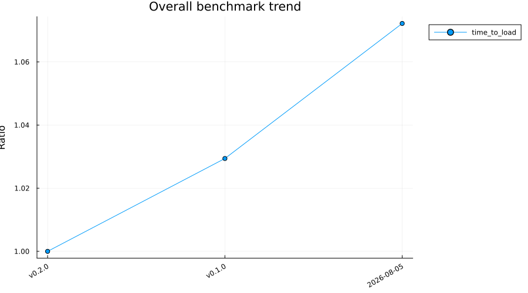

# [Performance over time](@id benchmarks)

How `ReparameterisedDistributions`'s benchmark suites have moved across recent revisions: an overall summary across the package first, then one section per suite.

## Summary

Each benchmark suite's headline timing across recent revisions.

| Suite | Median ratio | Trend | Status |
|:---|:---:|:---:|:---:|
| time_to_load | 1.07 | ↗ | ok |

_Ratio: latest vs oldest shown revision (1.00 = no change, higher = slower/larger). ⚠ reg = at/above the regression threshold._

_Tables below show the most recent 3 revisions, columns labelled by commit date._

## time_to_load

### Time

| Benchmark | v0.2.0 | v0.1.0 | 2026-08-05 |
|:---|:---:|:---:|:---:|
| time_to_load | 0.374 ± 0.0039 s | 0.385 ± 0.0047 s | 0.401 ± 0.0043 s |

### Memory

| Benchmark | v0.2.0 | v0.1.0 | 2026-08-05 |
|:---|:---:|:---:|:---:|
| time_to_load | 0.145 k allocs: 11 kB | 0.149 k allocs: 11.2 kB | 0.145 k allocs: 11 kB |

## Skipped & broken benchmarks

_No known skipped or broken benchmarks._

## Per-benchmark timelines

Show 1 plot

## About these benchmarks

`ReparameterisedDistributions` benchmarks its core operations to track performance over time.

Describe here what the suite covers (the operations measured, any analytical vs
numerical comparisons), how to run it, and how to interpret the history below.
